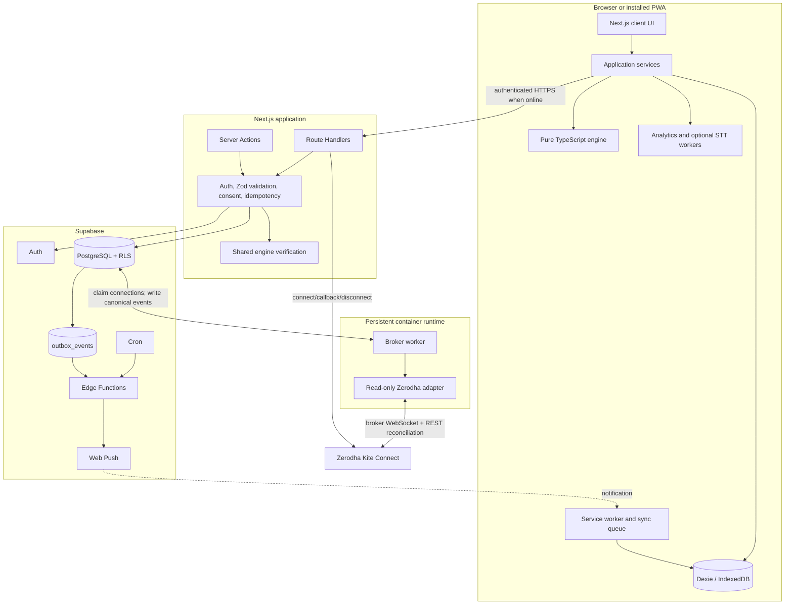
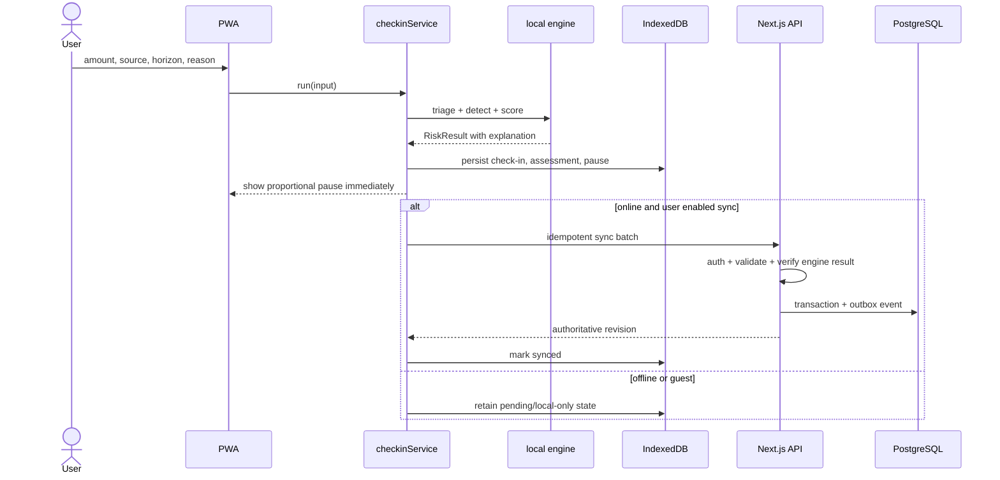

# ARCHITECTURE.md: Thehrav (SANGYAN Track D)

> Read order: `SPEC.md` (what and why) -> this file (how) -> `TASKS.md` (work breakdown) -> `TRACKER.md` (live status).
> If documents conflict, `SPEC.md` section 3 (guardrails), section 8 (maths), and this file's security invariants win. Record the correction in `TRACKER.md`.
> **MUST / MUST NOT** rules are test-enforced. **SHOULD** is a strong default. Architecture decisions are recorded in section 22.

---

## 1. System at a glance

| Attribute | Decision |
|---|---|
| Product | Full-stack, installable, mobile-first Progressive Web App |
| Web framework | Next.js App Router + React + strict TypeScript |
| Backend | Next.js Route Handlers and Server Actions; no separate NestJS service |
| Database | Supabase-managed PostgreSQL |
| Identity | Optional Supabase Auth account; local guest mode remains usable |
| Authorization | PostgreSQL grants plus Row-Level Security on every exposed user table |
| Offline | App shell and core journey work offline; IndexedDB stores the local working set and sync queue |
| Risk computation | Shared, deterministic TypeScript engine runs locally and is re-run or verified on the server for synced decisions |
| Data minimisation | Raw CSV and raw journal audio stay on-device by default; only consented canonical records sync |
| Broker integration | Zerodha Kite Connect first, using broker-hosted login and read-only order/trade updates; Angel One remains a later adapter |
| Background work | A persistent Dockerized Node broker worker maintains broker WebSockets; an Edge Function dispatches PostgreSQL outbox events and Cron retries delivery |
| Hosting | Vercel for Next.js; managed Supabase; a persistent container host for the broker worker |
| Local infrastructure | Supabase CLI using Docker; Next.js may run on the host or through its production Dockerfile |
| AI | Optional and off by default; core behavior is deterministic and explainable |
| Languages | English, Hindi, Marathi, with an extensible namespaced translation system |

**One-sentence architecture:** Thehrav is a full-stack, local-first Next.js PWA backed by Supabase; with explicit consent it receives read-only Zerodha events through a persistent worker, evaluates behavioral risk with a shared deterministic engine, and delivers a timely, explainable cooling-off prompt through Web Push.

The PWA remains useful without a broker connection. Live detection requires a signed-in account, an active broker session, push permission, and explicit consent. Thehrav never places, modifies, cancels, or blocks an order.

---

## 2. Architectural invariants

| ID | Invariant | Enforcement |
|---|---|---|
| I1 | `src/engine/**` MUST NOT import React, Next.js, DOM APIs, Supabase, Dexie, i18n, route handlers, or feature code. | ESLint restricted imports + dependency-cruiser test |
| I2 | UI features MUST call domain behavior through application services; they MUST NOT call engine internals or Supabase tables directly. | Architecture test |
| I3 | Only `src/storage/local/**` may import Dexie; only `src/lib/supabase/**` may create Supabase clients. | Architecture test |
| I4 | Every network mutation carrying user data MUST use an authenticated, allowlisted application endpoint, a documented consent purpose, schema validation, and data minimisation. Raw CSV and audio uploads are denied by default. | Route tests + network allowlist + consent tests |
| I5 | No user-visible JSX string literals. All product copy comes from i18n keys. | ESLint + locale parity test |
| I6 | Every locale value and runtime-generated sentence MUST pass `guardrails.lintCopy`. | CI scan + `safeText()` |
| I7 | No output may recommend, rank, or predict an instrument. | Refusal, lint, and snapshot tests |
| I8 | Every risk result and pause MUST include fired signals, value versus threshold, contribution, and rule overrides. | Required types + snapshots |
| I9 | Pact tightening applies immediately; loosening becomes effective only after the server-authoritative delay. Offline conflicts MUST resolve to the stricter effective Pact. | Engine, API, RLS, and multi-device tests |
| I10 | BRS MUST NOT use trade count, P&L, session time, or engagement frequency. | Metrics purity test |
| I11 | CSV parsing MUST retain only canonical allowlisted columns. The raw file MUST NOT be persisted or uploaded by default. | Parser and network tests |
| I12 | After the first successful load, onboarding, Pact, check-in, pause, journal text, simulator, and queued writes MUST work offline. | Playwright offline E2E |
| I13 | Engine randomness MUST use an injected seeded RNG, never `Math.random`. | ESLint + deterministic tests |
| I14 | Engine time MUST be injected. Worker and network boundaries pass timestamps as primitives, never function-bearing `Clock` objects. | ESLint + contract tests |
| I15 | Every exposed Supabase table MUST have explicit grants, enabled RLS, and allow/deny tests for anonymous, authenticated, owner, and non-owner access. | Supabase database tests |
| I16 | Service-role credentials MUST never be included in the browser bundle. | Environment scan + build test |
| I17 | Sync mutations MUST be idempotent and use client-generated IDs, revision numbers, and idempotency keys. | API integration tests |
| I18 | Background delivery MUST use an outbox; a database commit MUST NOT depend on a best-effort push call. | Integration test |
| I19 | Broker secrets, request tokens, access tokens, and encryption keys MUST remain server-side, encrypted at rest where stored, and redacted from logs. | Secret scan + log-redaction + database tests |
| I20 | Broker adapters MUST expose observation methods only. Place, modify, cancel, basket, GTT, and funds-transfer operations MUST NOT exist in the adapter interface or route allowlist. | Type-level contract + architecture tests |
| I21 | Only the broker callback may exchange a short-lived request token. State/nonce, authenticated ownership, consent, and exact redirect validation are mandatory. | Route and replay tests |
| I22 | A broker disconnect MUST stop the worker session, revoke/delete stored access material, and stop new event ingestion and push triggers. | Integration and deletion tests |
| I23 | The product MUST state that detection follows broker events and cannot block an order placed in the broker's own app. | Copy snapshots + release checklist |

---

## 3. High-level component diagram



Layering direction:

```text
UI -> application services -> engine/local storage/API client
Route Handler -> validation/auth/consent -> engine -> repository -> PostgreSQL
Broker WebSocket -> persistent worker -> canonical event transaction -> outbox -> Web Push
Edge Function -> outbox consumer -> Web Push
```

No lower layer imports a higher layer.

---

## 4. Repository layout

```text
thehrav/
|-- app/
|   |-- (public)/about/page.tsx
|   |-- (auth)/login/page.tsx
|   |-- (pwa)/
|   |   |-- onboarding/  home/  pact/  checkin/  pause/
|   |   |-- journal/  import/  review/  simulator/  panic/  settings/
|   |   `-- layout.tsx
|   |-- api/
|   |   |-- sync/route.ts
|   |   |-- checkins/route.ts
|   |   |-- pacts/route.ts
|   |   |-- journals/route.ts
|   |   |-- brokers/zerodha/connect/route.ts
|   |   |-- brokers/zerodha/callback/route.ts
|   |   |-- brokers/zerodha/status/route.ts
|   |   |-- brokers/zerodha/disconnect/route.ts
|   |   |-- internal/broker-events/route.ts
|   |   |-- push/subscriptions/route.ts
|   |   `-- account/delete/route.ts
|   |-- layout.tsx
|   `-- manifest.ts
|-- src/
|   |-- features/          # client screens, components, hooks
|   |-- services/          # application orchestration
|   |-- engine/            # pure deterministic domain package
|   |-- guardrails/        # copy lint, refusal, safe text
|   |-- storage/
|   |   |-- local/         # Dexie schema, repos, sync queue
|   |   `-- server/        # PostgreSQL repositories
|   |-- lib/
|   |   |-- supabase/      # browser, server, and admin clients
|   |   |-- auth/          # session and authorization helpers
|   |   |-- validation/    # Zod request and persisted-data schemas
|   |   |-- sync/          # idempotency, revisions, conflict policy
|   |   `-- push/          # VAPID subscription and payload helpers
|   |-- workers/           # analytics.worker, optional stt.worker
|   |-- i18n/locales/{en,hi,mr}/
|   |-- config/
|   `-- ui/
|-- public/
|   |-- sw.js
|   |-- icons/
|   |-- fonts/
|   |-- sample-data/
|   `-- data/index-history.json
|-- supabase/
|   |-- config.toml
|   |-- migrations/
|   |-- seed.sql
|   |-- tests/
|   `-- functions/
|       `-- dispatch-outbox/
|-- apps/
|   `-- broker-worker/    # persistent Node process; read-only broker adapters
|-- tools/synth/
|-- fixtures/
|-- tests/{arch,api,db,e2e,engine,guardrails,privacy,sync}/
|-- Dockerfile
|-- .dockerignore
|-- next.config.ts
|-- vitest.config.ts
|-- playwright.config.ts
|-- tsconfig.json
|-- package.json
`-- pnpm-lock.yaml
```

The repository root is authoritative. These five planning documents remain at the root unless the team moves all of them together and updates every reference.

---

## 5. Technology stack and version policy

| Concern | Choice | Notes |
|---|---|---|
| Runtime | Node.js 24 LTS | Pin an exact supported patch in `.nvmrc`/tool config and CI |
| Package manager | Current pnpm major | Pin exact version in `packageManager` |
| Full-stack framework | Current stable Next.js App Router | React Server Components for public shells; client components for PWA flows |
| UI | React 19 + strict TypeScript | Enable `noUncheckedIndexedAccess` |
| Styling | Tailwind CSS 4 + CSS design tokens | Avoid utilities unsupported by target low-end browsers |
| Client state | Zustand | Transient UI/session state only |
| Server state | TanStack Query | Fetching, retries, optimistic updates, sync status |
| Local storage | Dexie over IndexedDB | Versioned migrations and local working set |
| Backend data | Supabase PostgreSQL | SQL migrations committed under `supabase/migrations` |
| Auth | Supabase Auth | Guest mode first; account is optional for sync |
| Authorization | PostgreSQL grants + RLS | Defense in depth; do not rely on UI checks |
| Validation | Zod | Shared boundary schemas for routes, sync, import/export |
| i18n | i18next + react-i18next | Lazy namespaces; en/hi/mr parity |
| CSV | PapaParse inside a dedicated worker | Pass `File`/`Blob` or chunks; do not enable a nested Papa worker |
| Worker RPC | Comlink | JSON data and transferable buffers only |
| Charts | Small SVG/canvas charts; lazy Recharts only where needed | Protect initial bundle |
| PWA | Next manifest + custom Workbox service worker | Prompted updates; never reload during a pause |
| Background work | Edge Function dispatcher + Supabase Cron retry + outbox | Low-latency best effort with durable recovery |
| Broker SDK | Official `kiteconnect` TypeScript/JavaScript client behind a narrow adapter | Zerodha first; pin and wrap the SDK |
| Broker listener | Persistent Node.js worker in Docker | Required because serverless/Edge runtimes cannot hold an all-day WebSocket |
| Token protection | Application-layer authenticated encryption; managed KMS before broad production | Encryption key is never stored in PostgreSQL or exposed to the browser |
| Testing | Vitest, Testing Library, fast-check, Playwright, axe, Supabase DB tests | Unit through full-stack E2E |
| Local backend | Supabase CLI + Docker | Do not manually reproduce the Supabase stack in Compose |

Architecture documents specify supported majors and policy. `package.json` and `pnpm-lock.yaml` pin exact dependency versions.

---

## 6. Domain and synchronization contracts

`src/engine/types.ts` is the canonical domain contract. It contains the `Trade`, `Pact`, `CheckIn`, `SignalHit`, `JournalEntry`, `PauseEvent`, `RiskResult`, simulator, and metrics types defined in `SPEC.md` sections 7 and 8.

Infrastructure metadata is kept outside engine types:

```ts
export type SyncStatus = 'local_only' | 'pending' | 'synced' | 'conflict';

export interface SyncMetadata {
  id: string;                 // UUID generated on the client
  userId?: string;            // absent in guest mode
  clientCreatedAt: string;
  serverReceivedAt?: string;
  revision: number;
  idempotencyKey: string;
  syncStatus: SyncStatus;
}

export interface WorkerDetectRequest {
  history: Trade[];
  pact: Pact;
  checkIn?: Pick<CheckIn, 'fundSource' | 'borrowKind' | 'ts'>;
  nowEpochMs: number;
  config: EngineConfig;
}
```

`Clock` and `Rng` may be used inside a process but MUST NOT cross worker or HTTP boundaries. Boundaries use ISO strings, epoch milliseconds, seeds, JSON objects, and transferable buffers.

All thresholds and weights come from `src/config/defaults.ts`; engine modules never hardcode them.

---

## 7. Pure engine

The existing engine modules remain framework-independent:

| Module | Responsibility |
|---|---|
| `parse` | Canonical CSV mapping, allowlist, normalization, FIFO pairing |
| `signals` | Revenge, overtrade, late-night, loss-hold, breach, source signals |
| `score` | Weighted score, hard-rule overrides, explanation |
| `pact` | Validation, compliance, tightening, delayed loosening |
| `triage` | Money source, runway, borrowing break-even |
| `sim` | Recovery, leverage, fee drag, seeded Monte Carlo, cohort |
| `metrics` | PHR, II, JC, RA, BRS and retrospective replay difference |

Purity contract: `(inputs, injected time/seed/config) -> JSON-serialisable output`. No I/O, environment access, logging, database calls, DOM, framework imports, or unseeded randomness.

The engine runs in three contexts:

1. Browser main thread for cheap checks.
2. Browser Web Worker for CSV, simulation, and long histories.
3. Next.js server for verification of synced decisions and ingestion events.

---

## 8. Application and server boundaries

### Client services

| Service | Responsibility |
|---|---|
| `pactService` | Resolve local effective Pact, apply changes, queue sync |
| `checkinService` | Triage -> detect -> score -> pause -> local persistence -> sync |
| `importService` | Parse a local file in a worker; persist canonical trades locally |
| `journalService` | Store text/transcript locally; sync only with explicit setting |
| `metricsService` | Compute local behavioral metrics |
| `syncService` | Push/pull batches, retry idempotently, surface conflicts |
| `pushService` | Request permission and register/remove a push subscription |
| `brokerConnectionService` | Start broker login, show session freshness, and disconnect; never handles the API secret or access token |
| `dataService` | Local/cloud export and scoped delete operations |

### Server routes

Every route performs authentication where required, Zod validation, consent/purpose checks, rate limiting, idempotency, engine verification where relevant, and a transaction that includes any outbox event.

| Route | Purpose |
|---|---|
| `POST /api/sync` | Batch idempotent local changes and return authoritative revisions |
| `POST /api/checkins` | Create/verify a check-in and risk assessment |
| `PATCH /api/pacts/:id` | Apply tighten/loosen rules server-side |
| `GET /api/brokers/zerodha/connect` | Create signed state and redirect the authenticated user to Zerodha's hosted login |
| `GET /api/brokers/zerodha/callback` | Validate state, exchange the one-time request token server-side, encrypt access material, and activate the connection |
| `GET /api/brokers/zerodha/status` | Return provider, connection health, and expiry only; never return credentials |
| `POST /api/brokers/zerodha/disconnect` | Revoke consent, stop the worker lease, and delete stored access material |
| `POST /api/internal/broker-events` | Optional worker-to-app boundary protected by workload identity/signature; accepts canonical events only |
| `POST /api/journals` | Sync text transcript only when enabled |
| `POST/DELETE /api/push/subscriptions` | Register or revoke a device subscription |
| `GET /api/export` | Export the authenticated user's cloud records |
| `DELETE /api/account` | Delete cloud data and revoke subscriptions/session |

Server Actions MAY be used for same-origin form mutations, but public/event endpoints use Route Handlers with explicit HTTP contracts.

---

## 9. Core flows

### 9.1 Offline-capable check-in



### 9.2 Live Zerodha event and intervention

```text
User -> Thehrav connect route -> Zerodha-hosted login -> callback validates state
-> server exchanges request token and stores encrypted access material
-> persistent worker claims the active connection and maintains the order WebSocket
-> worker normalizes and deduplicates order/trade updates, with REST reconciliation after reconnect
-> load effective Pact and recent canonical history -> shared engine
-> persist canonical event + assessment + pause + outbox in one transaction
-> Edge Function dispatches generic Web Push; Cron retries undispatched rows
-> authenticated PWA opens the explanation, journal, and cooling-off flow
```

The MVP provider is Zerodha. Development uses the official sandbox where available and deterministic synthetic fixtures for automated tests and the recorded demo fallback. A live demo is enabled only with approved app credentials and a consenting test account. Broker events arrive after an order/trade update; therefore Thehrav can interrupt the likely next decision but cannot block the event it just observed or any order placed in the broker app.

### 9.3 Pact conflict resolution

- Tightening applies immediately locally and on the server.
- Loosening is recorded as `pending` with a server-computed `effectiveAt`.
- A local clock never activates a synced loosening before the server accepts it.
- When devices conflict, merge field-by-field to the stricter effective value.
- L3 lock state uses explicit `lockStartedAt`, `lockExpiresAt`, and `reason`; it is not inferred from the Pact loosening delay.

---

## 10. Data architecture

### 10.1 Local IndexedDB

| Table | Purpose |
|---|---|
| `trades` | Canonical, PII-minimised imported events |
| `pacts` | Effective and pending local Pact state |
| `checkins` | Local check-ins and sync metadata |
| `riskAssessments` | Score, tier, explanation, engine/config version |
| `journal` | Text/transcript; optional capped raw audio |
| `pauses` | Pause state and outcome |
| `settings` | Locale, consent, account/sync preferences |
| `syncQueue` | Idempotent pending mutations |
| `meta` | Schema version and timestamps |

### 10.2 Supabase PostgreSQL

| Table | Key properties |
|---|---|
| `profiles` | `user_id` PK; minimum profile data |
| `devices` | user-owned device and locale metadata |
| `consents` | purpose, policy version, granted/revoked timestamps |
| `broker_connections` | user/provider identity, encrypted access material, expiry, health, lease, consent reference; never exposed directly to clients |
| `pacts` | authoritative effective Pact and revision |
| `pact_changes` | requested change, classification, `effective_at` |
| `checkins` | canonical consented check-in fields |
| `trade_events` | canonical minimal broker/import events; provider event ID, source, dedupe hash, and retention metadata |
| `risk_assessments` | engine/config version, result and explanation JSON |
| `pause_events` | tier, duration, outcome; no engagement gamification |
| `journal_entries` | transcript only when journal sync is enabled |
| `push_subscriptions` | encrypted endpoint material, revocable per device |
| `outbox_events` | durable background work with retry state |
| `audit_events` | security-relevant metadata only; never free text or raw CSV |

RLS owner policy is necessary but not sufficient: grants are restricted per operation, non-owner denial is tested, and service-role usage is limited to trusted background functions.

### 10.3 Data classification

| Class | Examples | Default |
|---|---|---|
| Local-only sensitive | Raw CSV, raw audio, rejected CSV cells | Never uploaded |
| Connected sensitive | Encrypted broker access material and canonical broker events | Explicit broker consent; shortest practical retention |
| Optional sync sensitive | Journal transcript and imported canonical trade events | Off until explicit consent |
| Sync operational | Pact, pause outcome, device subscription | Enabled only for signed-in sync users |
| Public application data | Locale bundles, synthetic fixtures, cited index snapshot | Cacheable |

Export and delete operate separately on local and cloud data and offer a combined authenticated action. Account deletion revokes push subscriptions, deletes user-owned cloud rows, clears the local database, and signs out.

---

## 11. Workers and concurrency

| Worker | API | Notes |
|---|---|---|
| `analytics.worker` | `parse(fileOrChunks, opts)`, `detect(request)`, `simulate(input)`, `counterfactual(input)` | Imports only engine and parser code |
| `stt.worker` | `init`, `transcribe`, `dispose` | Optional, capability-gated, and never required for the journey |

Worker messages contain JSON and transferable buffers only. `AbortSignal`, callbacks, and progress events use explicitly supported Comlink proxies; domain objects remain serialisable. A worker failure falls back to the main thread only for bounded inputs.

---

## 12. PWA architecture

`app/manifest.ts` defines the manifest. `public/sw.js` is built from a versioned service-worker source using Workbox tooling.

| Resource | Strategy |
|---|---|
| Versioned app shell, icons, active locale, fonts | Precache |
| Navigations for PWA routes | Network-first with cached offline shell fallback |
| Public index snapshot and sample fixtures | Cache-first, versioned |
| Authenticated API GETs | Network-first; do not place sensitive responses in shared Cache Storage |
| Mutations | Network-only through `syncService`; failures remain in IndexedDB queue |
| STT model | Cache-first only after explicit consent and size disclosure |

Update policy is prompted, not automatic. Reload is deferred while a check-in, journal recording, or pause is active.

Web Push is opt-in. Push payloads contain a generic event identifier and calm message, not amounts, symbols, fund source, journal text, or risk details. The PWA fetches authorized details after opening.

---

## 13. Routing

Public and auth routes may use Server Components. Routes that depend on IndexedDB, workers, recording, or offline state use client components behind a PWA layout.

| Route | Responsibility |
|---|---|
| `/` | Resolve onboarding/home based on local state |
| `/login` | Optional account sign-in for sync |
| `/onboarding` | Language, privacy, local-versus-sync choice |
| `/home` | Check-in, panic entry, Pact summary, sync status |
| `/pact` | Rule editing and delayed-loosening state |
| `/checkin` | Amount, source, horizon, reason |
| `/pause` | Non-deep-linkable pause state |
| `/journal` | Text/voice journal and replay |
| `/import` | Local CSV import and mapping |
| `/review` | Pattern timeline and retrospective replay difference |
| `/simulator` | Consequence simulation |
| `/panic` | Immediate guided pause |
| `/settings` | Locale, account, sync consents, export/delete, push |
| `/about` | Guardrails, limitations, privacy, data flow |

---

## 14. Internationalisation and guardrails

- Namespaces live under `src/i18n/locales/<locale>/<feature>.json`.
- Key parity is mandatory across en, hi, and mr.
- INR and dates use `Intl` with `Asia/Kolkata` where product logic requires IST.
- Layouts tolerate at least 40% text expansion.
- Fonts are self-hosted.
- Engine output contains i18n keys and parameters, never composed advice text.
- `safeText` applies to runtime text before rendering.
- User journal text is rendered as text and is not passed through the copy linter as if it were system advice.
- Optional LLM functionality is excluded from the MVP. Adding it requires a new ADR, consent purpose, provider/data-retention review, and server-side secret handling.

---

## 15. Security and privacy

| Control | Implementation |
|---|---|
| Authentication | Supabase Auth; secure server-readable session cookies following the supported SSR pattern |
| Authorization | Route authorization plus PostgreSQL grants and RLS |
| Secrets | Server/worker environment only; broker API secret, token-encryption key, service role, and VAPID private key never reach client code |
| Broker login | Broker-hosted login, signed single-use state/nonce, exact callback allowlist, server-side token exchange |
| Broker tokens | Encrypted before persistence, decrypted only in the worker/backend, never returned by status/export routes, deleted on disconnect |
| Read-only boundary | Narrow adapter omits every order mutation; egress and route allowlists deny accidental trading operations |
| Validation | Zod at every HTTP and sync boundary; PostgreSQL constraints remain authoritative |
| CSRF | SameSite cookies, origin checks, and framework-supported mutation protections |
| Abuse control | Per-user/IP rate limits on auth, event ingestion, push registration, and exports |
| CSP | Next.js response headers; allow only required self/Supabase/model endpoints |
| Logging | Request/event IDs and violation codes only; no raw CSV, journal text, audio, tokens, or financial payloads |
| Supply chain | Lockfile, dependency allowlist, audit, secret scan, reproducible CI |
| Data lifecycle | Purpose-specific retention, export, consent revocation, local delete, cloud account delete |
| Push privacy | Generic payload; protected details fetched after authenticated open |

The public Supabase publishable key is allowed in the client. The service-role key is not. Admin clients are created only in server-only modules and only for operations that cannot safely run under the user's JWT.

---

## 16. Performance and reliability budgets

| Budget | Target |
|---|---|
| Initial client JavaScript, excluding optional STT | <= 300 KB gzip target; document any Next.js framework overhead exception |
| Largest feature chunk | <= 150 KB gzip excluding optional STT |
| Cached PWA LCP | <= 1.5 s on target device |
| First throttled load LCP | <= 4.0 s |
| 10k trade parse/detect | <= 1.5 s in analytics worker on agreed phone profile |
| Monte Carlo 1,000 x 250 | <= 300 ms in worker on agreed phone profile |
| Check-in API p95 | <= 500 ms excluding cold start; UI never waits to show local result |
| Sync | Retry with exponential backoff; idempotent duplicate delivery |
| Broker event latency | Display observed-at, received-at, and connection health; never promise prevention or zero-latency blocking |

The local result is immediate. Network verification updates sync state but does not block the reflection flow.

---

## 17. Error and degraded modes

| Condition | Behavior |
|---|---|
| Offline | Complete local journey; queue consented mutations |
| Supabase unavailable | Keep local mode; show calm sync status; retry later |
| Session expired | Preserve local work; request sign-in before cloud sync |
| Broker session expired | Mark connection `reauth_required`, stop ingesting, and prompt the user to reconnect through broker login |
| Broker WebSocket disconnect | Exponential reconnect, lease-safe resubscription, REST reconciliation, and idempotent deduplication |
| Worker unavailable | Show stale connection state; preserve manual/offline check-in; alert operators without claiming live protection |
| Sync conflict | Apply documented merge; stricter Pact wins; surface conflict status |
| IndexedDB unavailable | In-memory session with visible non-persistence warning |
| Worker crash | Bounded main-thread fallback or retry |
| Push unsupported/denied | In-app reminders and status only |
| STT unsupported | Text journal remains fully functional |
| Database/outbox retry | Transaction remains committed; worker retries idempotently |
| Service-worker update during pause | Defer activation/reload until flow is idle |

---

## 18. Testing architecture

| Layer | Scope |
|---|---|
| Engine unit/property | Formula boundaries, FIFO conservation, determinism, score monotonicity, Pact rules |
| Component | Screens, locales, accessibility, reasons and assumptions |
| Architecture | Import boundaries and server-only/client-only separation |
| API | Auth, Zod rejection, idempotency, ownership, engine verification |
| Database | Migrations, constraints, grants, RLS owner/non-owner allow and deny cases |
| Sync | Offline queue, duplicate delivery, revisions, stricter-Pact conflict resolution |
| Privacy | PII drop, raw-file non-upload, consent gating, log redaction, delete/export |
| PWA E2E | Installability, offline journey, update deferral, queued sync |
| Broker contract | Login state/replay, token encryption/redaction, read-only adapter surface, normalization, reconnect, dedupe, disconnect |
| Full-stack E2E | Sign in, sync, cross-device Pact, sandbox/replayed broker event, outbox, push stub |
| Performance | Bundle, Lighthouse, worker budgets, API timing |

CI order:

```text
install -> typecheck -> lint -> unit -> architecture -> guardrails
-> Supabase start -> migrations -> DB/RLS tests -> API/integration tests
-> build -> bundle check -> E2E online/offline -> Lighthouse
```

Only synthetic data is committed to the repository or used in automated tests. Live broker credentials and real financial payloads are never recorded in fixtures, screenshots, logs, or documentation.

---

## 19. Docker and environments

Docker is development and portability infrastructure, not a requirement for PWA users.

Local development:

```bash
supabase start
pnpm dev
pnpm broker:dev
```

`supabase start` uses Docker for local PostgreSQL, Auth, Realtime, Storage, and Edge Functions. Next.js normally runs on the host for fast refresh. The broker worker runs as a separate process or Docker container and uses a fake/replay adapter unless an explicitly configured sandbox session is active.

The root multi-stage `Dockerfile` builds a Next.js standalone production image. `apps/broker-worker/Dockerfile` builds the persistent worker image:

```text
base -> dependencies -> build -> minimal non-root runner
```

Do not maintain a parallel hand-written Docker Compose definition for the Supabase stack. CI may run the Next.js app directly or through the Docker image, but database integration tests use the Supabase CLI environment.

Environments:

| Environment | Next.js | Supabase | Data |
|---|---|---|---|
| Local | host `pnpm dev` or Docker | Supabase CLI/Docker | replay adapter; optional broker sandbox |
| Preview | Vercel preview | isolated preview/staging project | broker sandbox/replay; no production tokens |
| Production | Vercel + persistent broker-worker container | production project | consented user data and encrypted short-lived broker tokens |

---

## 20. Build and deployment commands

| Command | Purpose |
|---|---|
| `pnpm dev` | Next.js development server |
| `pnpm build` / `pnpm start` | Production build and run |
| `pnpm test` | Vitest unit/component tests |
| `pnpm test:db` | Supabase migration, grants, and RLS tests |
| `pnpm test:api` | Route integration tests |
| `pnpm test:sync` | Offline/idempotency/conflict suite |
| `pnpm e2e` | Playwright online/offline E2E |
| `pnpm lint` / `typecheck` | Static quality gates |
| `pnpm size` / `pnpm lhci` | Bundle and Lighthouse checks |
| `pnpm supabase:start` | Start local Supabase through Docker |
| `pnpm supabase:reset` | Reapply migrations and synthetic seed locally |
| `pnpm docker:build` | Build the standalone Next.js image |
| `pnpm broker:dev` | Run the worker with replay or sandbox adapter |
| `pnpm broker:test` | Run adapter, reconnect, dedupe, and no-order-surface tests |
| `pnpm broker:docker:build` | Build the persistent broker-worker image |

Vercel deploys the Next.js application. A persistent container platform deploys the broker worker. Supabase migrations are applied through a reviewed CI release step, never implicitly by a browser deployment.

---

## 21. Scope boundary for the circuit breaker

The current MVP can intervene in three ways:

1. A user voluntarily starts a check-in.
2. A local imported history informs the next check-in.
3. With consent and a valid session, a Zerodha event triggers an automatic assessment and timely notification.

This is a behavioral circuit breaker, not an exchange or broker risk control. Thehrav receives updates after broker activity, so it cannot stop the observed order or guarantee interception before another order. It improves the chance of reflection through rapid detection, a generic push, and a protected cooling-off flow. It must not place trades, provide advice, scrape accounts, read SMS/OTP, or claim control over Zerodha.

---

## 22. Architecture Decision Records

| ID | Decision | Rationale | Consequence |
|---|---|---|---|
| ADR-1 | Full-stack, local-first PWA | Enables offline resilience plus sync, push, recovery, and connected events | More security and data-lifecycle work than static-only |
| ADR-2 | Next.js App Router for web and backend | One TypeScript application surface; no separate NestJS API | Long-lived broker sockets run in a separate worker process |
| ADR-3 | Supabase PostgreSQL/Auth/RLS | Managed relational backend with authorization close to data | RLS and grants require explicit tests |
| ADR-4 | Guest mode plus optional account | Low-friction Bharat-first onboarding without giving up sync | Local and cloud lifecycle must both be supported |
| ADR-5 | Shared deterministic engine | Same explainable decision logic offline and server-side | Engine boundaries must remain pure and serialisable |
| ADR-6 | Raw CSV/audio local by default | Minimises sensitive-data exposure | Connected detection receives only consented canonical events |
| ADR-7 | Server-authoritative Pact loosening | Prevents offline clock and multi-device bypass | Conflicts resolve to stricter effective rules |
| ADR-8 | PostgreSQL outbox for push/jobs | Avoids losing notifications between commit and delivery | Requires retry and idempotent consumers |
| ADR-9 | Custom Workbox service worker | Full control over offline shell, update deferral, and sync queue | Requires dedicated E2E coverage |
| ADR-10 | Supabase CLI Docker locally | Reproducible backend without manually cloning managed infrastructure | Docker Desktop/Engine is a contributor prerequisite for full integration tests |
| ADR-11 | No LLM in MVP | Protects privacy, determinism, guardrails, cost, and schedule | Voice/text structure uses deterministic forms |
| ADR-12 | Zerodha-first official read-only integration | Order WebSocket updates cover broker activity without credential scraping | Requires daily session renewal, consent, encryption, and provider approval/terms review |
| ADR-13 | Persistent Dockerized broker worker | Live WebSockets outlive serverless request limits | Adds a separately deployed and monitored runtime |
| ADR-14 | Synthetic replay remains test/fallback only | Keeps tests deterministic and the demo recoverable | Any replayed event must be visibly labelled simulated |

---

## 23. Glossary

| Term | Meaning |
|---|---|
| Local-first | Immediate local behavior with optional, consented cloud synchronization |
| Guest mode | Full core journey without an account; data remains local |
| Pact | Rules the user sets while calm; tightening is immediate and loosening delayed |
| Check-in | Pre-decision ritual capturing source, amount, horizon, and reasoning |
| Risk assessment | Explainable output from deterministic signals and hard rules |
| Outbox | Database table recording background work in the same transaction as domain changes |
| RLS | PostgreSQL Row-Level Security restricting rows by authenticated user |
| Sync revision | Monotonic version used for idempotency and conflict handling |
| Broker connection | Consented, revocable link to an official broker API; never authority to trade |
| Broker worker | Persistent server process that listens for read-only events, normalizes them, and invokes the risk pipeline |
| Synthetic event | Clearly labelled test or fallback event; not presented as live broker activity |
| BRS | Behavioral Resilience Score based on process, never P&L or engagement |
