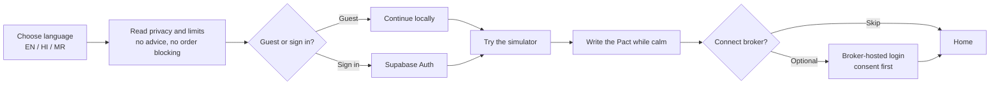
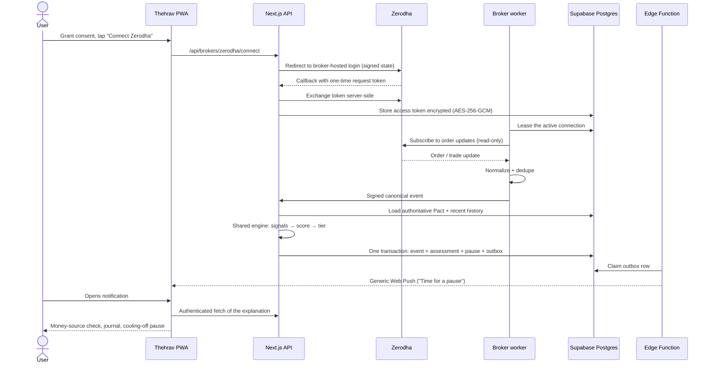
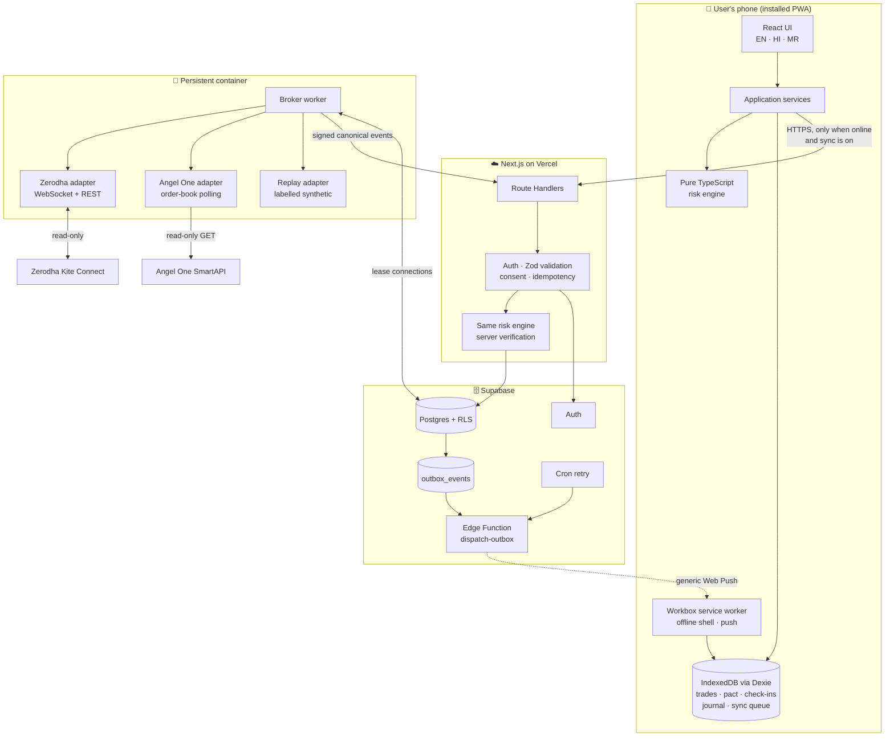
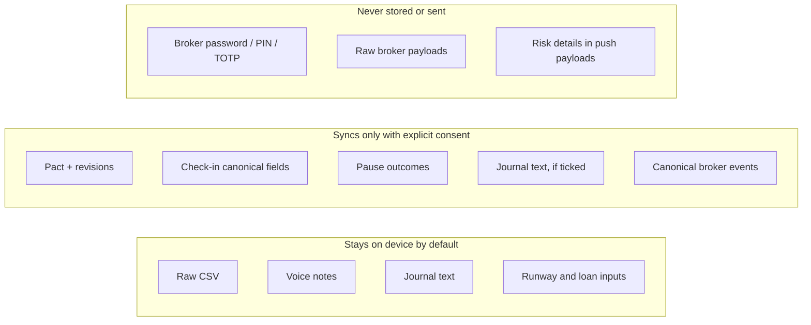

# Thehrav (ठहराव): A Behavioral Circuit Breaker for Retail Investors

> **SANGYAN Investor Resilience Hackathon · Track D: Financial Habits and Behavioral Resilience**
>
> *Thehrav* (ठहराव) means "a pause" or "a steadying halt" in Hindi and Marathi. That is the whole product: a private, explainable pause placed between a trading impulse and the next rupee put at risk.

---

## Table of contents

1. [Overview](#1-overview)
2. [The problem](#2-the-problem)
3. [How Thehrav solves it](#3-how-thehrav-solves-it)
4. [Features and the reasoning behind each one](#4-features-and-the-reasoning-behind-each-one)
5. [User flows](#5-user-flows)
6. [System architecture](#6-system-architecture)
7. [Mathematical models used](#7-mathematical-models-used)
8. [Strategies we used, step by step](#8-strategies-we-used-step-by-step)
9. [Novelty: what makes Thehrav stand out](#9-novelty-what-makes-thehrav-stand-out)
10. [Feasibility](#10-feasibility)
11. [Viability](#11-viability)
12. [Impact and benefits](#12-impact-and-benefits)
13. [Honest limitations](#13-honest-limitations)
14. [References](#14-references)

---

## 1. Overview

| Item | Summary |
|---|---|
| **What it is** | A full-stack, local-first Progressive Web App (PWA) that notices signs of impulsive trading and inserts a proportional, explainable cooling-off pause before the user risks more money |
| **Who it is for** | First-time and vulnerable retail investors in Tier-2/3 Indian cities, especially people who trade on short-video tips, on low-end Android phones, in Hindi or Marathi |
| **Core intervention** | Money-source check-in → explainable behavioral signals → proportional pause → decision journal → process review |
| **What it never does** | Recommend, rank or predict any instrument; place, modify or cancel an order; ask for a broker password, PIN or OTP |
| **Languages** | English, हिन्दी, मराठी (full key parity, enforced by tests) |
| **Works offline** | Yes. The whole core journey runs on the device after the first load. An account is optional |
| **Broker connection** | Optional, consented and read-only: Zerodha Kite Connect first, Angel One SmartAPI as a second adapter |

**One-sentence pitch:** Trading apps are built to help people act faster; Thehrav is built to help them act *considered*. With consent it watches broker activity, recognizes a likely impulsive follow-up decision, and asks the user to pause against rules they wrote themselves while calm.

**Positioning:** investor-protection infrastructure, not a trading-productivity tool. Success is measured by more considered decisions and better adherence to self-authored rules. It is never measured by engagement, trade count, or profit and loss.

**Design principle:** *build a speed bump, not a guru.* Thehrav mirrors the user's own rules and stated intent back to them. It does not tell anyone what to buy, sell or hold.

---

## 2. The problem

### 2.1 What the data says

India's securities regulator has repeatedly measured how badly retail traders fare:

| Finding | Source |
|---|---|
| **93%** of more than 1 crore individual F&O traders lost money between FY22 and FY24, an average loss of about ₹2 lakh each, with aggregate losses above **₹1.8 lakh crore** | SEBI study, Sept 2024 ([press coverage](https://www.businesstoday.in/markets/story/93-of-individual-traders-incurred-losses-in-equity-fo-during-fy22-fy24-sebi-study-447102-2024-09-23), [press release copy](https://aibi.org.in/Sebipr/Updated_SEBI_Study_Reveals_93_percentage_of_Individual_Traders_Incurred_Losses_in_Equity_F&O_between_FY22_and_FY24.pdf)) |
| More than **75%** of loss-making F&O traders **kept trading** after consecutive loss-making years | Same SEBI study |
| **7 in 10** individual intraday traders in the equity cash segment lost money in FY23; this rose to **80%** for traders making more than 500 trades a year | [SEBI intraday study, July 2024](https://www.sebi.gov.in/reports-and-statistics/research/jul-2024/study-analysis-of-intraday-trading-by-individuals-in-equity-cash-segment_84946.html) |
| Loss-makers among traders **under 30** reached **76%**, and the under-30 share of intraday traders grew from 18% to 48% in five years | Same SEBI intraday study |
| Trading costs made loss-makers' losses **57% worse** | Same SEBI intraday study |
| Losses remain widespread: 87.7% of individual F&O traders still lost money in FY26 | [SEBI, Profitability of Individual Traders in Equity Derivatives (2026)](https://www.sebi.gov.in/sebi_data/attachdocs/aug-2026/1787233506209.pdf) |

The pattern in the data is behavioral. More trading frequency means more losses. People keep going after losing. Young, new participants are over-represented. Those are exactly the patterns a circuit breaker can address.

### 2.2 The behavioral mechanisms

Decades of behavioral-finance research describe why:

- **Loss aversion and the disposition effect.** Losses hurt about twice as much as equal gains please ([Kahneman & Tversky, 1979](https://doi.org/10.2307/1914185)). Investors hold losers too long and sell winners too early ([Shefrin & Statman, 1985](https://doi.org/10.1111/j.1540-6261.1985.tb05002.x); [Odean, 1998](https://doi.org/10.1111/0022-1082.00072)).
- **Revenge trading and risk-seeking after losses.** Traders who lose in the morning take on more risk in the afternoon ([Coval & Shumway, 2005](https://doi.org/10.1111/j.1540-6261.2005.00721.x)).
- **Overtrading.** The most active retail accounts earn the lowest net returns ([Barber & Odean, 2000](https://doi.org/10.1111/0022-1082.00226)), and the vast majority of day traders lose money ([Barber, Lee, Liu & Odean, 2014](https://doi.org/10.1016/j.finmar.2013.05.006)).
- **"Hot" emotional states.** Visceral states like fear and craving override the preferences people hold when calm ([Loewenstein, 1996](https://doi.org/10.1006/obhd.1996.0028); [Lerner et al., 2015](https://doi.org/10.1146/annurev-psych-010213-115043)).
- **Fast versus slow thinking.** Impulsive decisions are made by fast, intuitive System 1; a short pause gives deliberate System 2 a chance to engage ([Kahneman, 2011](https://us.macmillan.com/books/9780374533557/thinkingfastandslow)).

### 2.3 Our persona

> **Ramesh, 27, Nashik.** Works at a small business. Started derivatives trading after watching short-video tips. Uses a low-end Android phone and prefers Marathi or Hindi. Has recently lost money, and has thought about using an instant-loan app to fund the next trade "to win it back."

Ramesh does not need another tip, chart or prediction. He needs a calm voice, his own, at the moment he is least able to hear it.

### 2.4 The gap in today's tools

| Existing tool | What it does | What it misses |
|---|---|---|
| Broker apps | One-tap execution, notifications that bring you back to the market | Built for speed; no behavioral friction |
| Tip channels and finfluencers | Tell you what to buy | Increase FOMO and herd behavior |
| Trading journals | Record trades after the fact | No intervention at the moment of risk |
| Exchange or broker risk controls | Margin and position limits | Protect the system, not the person's own intent |

No common tool asks *whose money is this*, *why now*, and *does this match the rule you set yesterday*, right before the next trade.

---

## 3. How Thehrav solves it

Thehrav turns behavioral-finance research into a concrete, testable loop:

```text
Set rules while calm (the Pact)
   → optionally connect a broker (read-only, broker-hosted login)
   → broker activity or a manual check-in triggers an evaluation
   → declare whose money it is (money-source triage)
   → state the reason, horizon and exit condition (decision journal)
   → receive an explainable, proportional pause (friction ladder)
   → proceed, wait, or abandon
   → review whether the process matched the Pact (behavioral review)
```

Each step maps to a known mechanism:

| Step | Problem it targets | Research basis |
|---|---|---|
| **Pre-Commitment Pact** | Hot-state decisions overriding calm preferences | Commitment devices ([Bryan, Karlan & Nelson, 2010](https://doi.org/10.1146/annurev.economics.102308.124324); [Ariely & Wertenbroch, 2002](https://doi.org/10.1111/1467-9280.00441); [Thaler & Benartzi, 2004](https://doi.org/10.1086/380085)) |
| **Money-source triage** | Trading with emergency savings or instant loans | Mental accounting ([Thaler, 1999](https://doi.org/10.1002/(SICI)1099-0771(199909)12:3%3C183::AID-BDM318%3E3.0.CO;2-F)); the RBI's own [cooling-off rule for digital loans](https://www.rbi.org.in/Scripts/NotificationUser.aspx?Id=12382&Mode=0) |
| **Pattern detector** | Revenge trading, overtrading, late-night impulsivity, holding losers | [Coval & Shumway, 2005](https://doi.org/10.1111/j.1540-6261.2005.00721.x); [Barber & Odean, 2000](https://doi.org/10.1111/0022-1082.00226); [Odean, 1998](https://doi.org/10.1111/0022-1082.00072) |
| **Friction ladder** | Acting in a hot state | Choice architecture and "nudges" ([Thaler & Sunstein, 2008](https://yalebooks.yale.edu/book/9780300122237/nudge/)); cooling-off periods |
| **Decision journal** | Unexamined, tip-driven reasons | Implementation intentions ([Gollwitzer, 1999](https://doi.org/10.1037/0003-066X.54.7.493)) |
| **Consequence simulator** | Underestimating leverage and the maths of recovery | Loss-recovery asymmetry; leverage ruin probability |
| **Behavioral review** | Judging decisions by outcome rather than process | Process-based feedback that excludes P&L |

---

## 4. Features and the reasoning behind each one

| ID | Feature | Status |
|---|---|---|
| F1 | Money-Source Triage | Built |
| F2 | Pre-Commitment Pact | Built |
| F3 | Decision Journal (text; optional voice note) | Built |
| F4 | Explainable Pattern Detector | Built |
| F5 | Friction Ladder (L0–L3) | Built |
| F6 | Consequence Simulator | Built (normal-returns Monte Carlo; historical bootstrap still to come) |
| F7 | Optional account and cloud sync | Built |
| F8 | Broker connection and live event detection | Built; Zerodha live use needs broker app approval, Angel One adapter not yet tested on a live account |
| F9 | Behavioral review and post-loss review | Built |
| F10 | Panic companion | Built |
| F11 | Local CSV import | Built |
| F12 | Read-aloud and multilingual UI | Built |
| F13 | Labelled demo broker sessions | Built |

### F1. Money-Source Triage

**What it does.** Before a decision, the user states the amount, *whose money it is* (surplus, regular savings, emergency fund, or borrowed through an instant loan, credit card or EMI), and the horizon. If they choose, they can also enter emergency fund size, monthly expenses and loan rate.

**The reasoning.** The same ₹10,000 trade carries completely different risk depending on where the money came from. Borrowed money must clear an interest hurdle just to break even. Emergency money shortens the user's safety runway.

**How it works.**
- Each source carries a triage strength: surplus 0.0, savings 0.4, emergency 0.8, borrowed 1.0.
- Emergency runway: `runwayBefore = E / M`, `runwayWorst = (E − P) / M`.
- Borrowing break-even over `T` years at annual rate `i`: `r* = (1 + i)^T − 1`.
- **Hard rules:** borrowed money always triggers at least an L2 pause; emergency funds trigger at least L1.
- **Check-in plan floors:** a self-reported trigger of "make back a loss", "a tip" or "fear of missing a move" sets at least L1. So does having no exit plan on an intraday or borrowed-money trade.
- Optional inputs never leave the device.

### F2. Pre-Commitment Pact

**What it does.** While calm, the user writes their own rules: daily loss limit, maximum trades per day, cooldown after a loss, risk capital, an optional per-trade cap, no-trade windows (for example 23:00–05:00), and whether a breach should lock the check-in.

**The reasoning.** This is a commitment device, a classic finding from behavioral economics. People are better at setting rules in a "cold" state than following them in a "hot" one ([Ariely & Wertenbroch, 2002](https://doi.org/10.1111/1467-9280.00441)).

**How it works: the asymmetric-change rule.**
- **Tightening applies immediately.** A stricter rule is always welcome.
- **Loosening waits 24 hours**, timed by the *server's* clock. A user in a hot state cannot quietly relax their own rules, and changing the phone's clock does not help.
- If two devices disagree, the rules merge field by field to **the stricter value**.

### F3. Decision Journal

**What it does.** Captures the reason for the decision, the time horizon, and the exit condition, in at most three short steps. Text first; an optional voice note (recorded locally with the [MediaRecorder API](https://developer.mozilla.org/en-US/docs/Web/API/MediaRecorder), capped at 20 seconds) for users who prefer speaking.

**The reasoning.** Writing down *why* and *when I will exit* turns a vague urge into a concrete plan. Implementation intentions ("if X, then I will Y") are one of the best-supported techniques for closing the gap between intention and action ([Gollwitzer, 1999](https://doi.org/10.1037/0003-066X.54.7.493)).

**Privacy.** Journal text and audio stay on the device. Text syncs only if the user separately ticks a journal-sync option.

### F4. Explainable Pattern Detector

**What it does.** Runs deterministic detectors over the user's canonical trade history and current check-in:

| Signal | Default definition | Weight |
|---|---|---:|
| `revenge` | A new position within 15 minutes of a loss, at least 1.5× the size | 0.25 |
| `breach` | Breaks a Pact rule (checked in order: trade count, daily loss, per-trade cap, no-trade window, cooldown) | 0.25 |
| `source` | Triage strength of the current money source | 0.25 |
| `overtrade` | At least 8 trades in 30 minutes, or above the personal baseline once there is enough history | 0.10 |
| `late_night` | Inside a Pact no-trade window or the default 23:00–05:00 IST window | 0.10 |
| `loss_hold` | Median holding time of losing trades at least 2× that of winners | 0.05 |
| `size_escalation` | Position at least 2× the median of the last 10; explanatory only | 0 |

**The reasoning.** Each signal corresponds to a documented bias: revenge to post-loss risk-seeking, overtrade to overconfidence, loss_hold to the disposition effect, late_night to fatigue and impulsivity.

**Why it is explainable.** Every result carries *which* signal fired, the *value versus the threshold*, its *contribution* to the score, and any *hard-rule override*. The user sees, for example: "Your new position is 2.1× your last losing one, 6 minutes after it closed. Your rule says 10 minutes." There is no black box. All thresholds live in one config file ([src/config/defaults.ts](src/config/defaults.ts)).

### F5. Friction Ladder

**What it does.** Converts the score into a proportional pause:

| Tier | Normalized score | Intervention | Can skip? |
|---|---|---|---|
| **L0** | below 0.25 | Factual note and Pact reminder | Yes |
| **L1** | 0.25 to under 0.50 | 10-second breathing pause and acknowledgement | Yes |
| **L2** | 0.50 to under 0.75 | 2-minute reflection with two written answers | Yes, and the skip is logged |
| **L3** | 0.75 or above | Timed lock, **only if the user agreed to it in their Pact** | Not until the lock expires |

**The reasoning.** Too much friction and users uninstall; too little and nothing changes. A *proportional* ladder respects autonomy: L1 and L2 can always be skipped, and the only hard lock (L3) enforces a rule the user wrote in advance. The final tier is `max(tier from score, tier from hard rules)`, so a borrowed-money trade can never fall through to L0.

### F6. Consequence Simulator

**What it does.** Using the user's own amount and visible assumptions, it shows:
- **Loss-recovery asymmetry.** A 50% loss needs a 100% gain to recover: `g(x) = x / (1 − x)`.
- **Leverage wipe-out.** At leverage `L`, a move of `−1/L` wipes out the capital.
- **Fee drag** after `n` round trips: `A[n] = P · (1 + r − f)^n`.
- **Ruin probability** (barrier approximation): `2 · Φ(−(1/L) / (σ · √T))`.
- An **illustrative cohort**: a seeded Monte Carlo of many paths, with and without a daily loss limit.

**The reasoning.** People underestimate compounding losses and leverage. Seeing the maths with their *own* numbers works better than a generic warning. Every output is labelled as an illustration, never a forecast.

### F7. Optional account and cloud sync

**What it does.** Guest mode works fully offline. Signing in (Supabase Auth) adds cross-device recovery, a server-authoritative Pact, and the broker connection.

**The reasoning.** Requiring sign-up loses Tier-2/3 users at the door. Local-first means the product is useful immediately, and sync is something you choose, not a condition of use.

**How it works.** Every change is written to an IndexedDB queue with a client UUID, revision number and idempotency key. When online, it syncs in idempotent batches. The server **re-runs the same risk engine** to verify each decision and is the authority on the Pact.

### F8. Broker connection and live event detection

**What it does.** With explicit consent, the user connects Zerodha through **Zerodha's own hosted login**. A persistent worker listens for order and trade updates, normalizes them, and triggers a server-side assessment. If a pause is warranted, a generic Web Push notification invites the user to open the app.

**The reasoning.** A manual check-in only helps if the user remembers to open it, and in a hot state they won't. Watching official broker activity lets Thehrav reach out at the moment a likely revenge or overtrading follow-up is forming.

**Security by construction.**
- Thehrav never sees a broker password, PIN or TOTP.
- The one-time request token is exchanged on the server only; the access token is encrypted with AES-256-GCM and deleted on disconnect.
- The adapter interface **contains no method** to place, modify or cancel an order. Tests enforce this.
- Push payloads are generic ("Time for a pause"). Amounts, symbols, source and tier are fetched only after an authenticated open.

**Providers.** Zerodha [Kite Connect](https://kite.trade/docs/connect/v3/) via the [order WebSocket](https://kite.trade/docs/connect/v3/websocket/), with REST reconciliation after reconnects. Angel One [SmartAPI](https://smartapi.angelbroking.com/docs) via read-only order-book polling every 15 seconds.

### F9. Behavioral review and post-loss review

**What it does.** Shows process metrics, a timeline of flagged moments, and a calm post-loss review that asks "did this follow my plan?" rather than "did I make money?"

**The reasoning.** Judging decisions by their outcome ("resulting") rewards lucky gambles and punishes sound decisions that happened to lose. Thehrav's **Behavioral Resilience Score (BRS)** deliberately excludes P&L, trade count and screen time:

```text
PHR = honoured pauses / shown pauses              (Pause Honour Rate)
II  = tier-2-or-higher events / evaluated events  (Impulsivity Index)
JC  = check-ins with a journal / check-ins        (Journal Completion)
RA  = days within the Pact / evaluated days       (Rule Adherence)
BRS = 100 × (0.35·PHR + 0.25·RA + 0.20·(1 − II) + 0.20·JC)
```

A **retrospective replay difference** replays history without the events that would have triggered L2 or above. The UI labels it as a replay, not "loss avoided," because it does not prove cause and effect.

### F10. Panic companion

**What it does.** One tap from Home opens a guided pause with calm, factual context, for the moment the market is moving fast and the user feels the urge to act.

**The reasoning.** Panic selling and FOMO buying both happen in seconds. A single, always-available exit from the noise costs nothing and needs no data.

### F11. Local CSV import

**What it does.** Imports a broker trade-history CSV **on the device** with [PapaParse](https://www.papaparse.com/). Only allowlisted columns (timestamp, symbol, side, quantity, price, optional P&L and order ID) are kept; trades are paired first-in-first-out to compute P&L and holding time. The raw file is discarded and never uploaded.

**The reasoning.** Users without a broker connection still get personalized detection, and their most sensitive file never leaves the phone.

### F12. Multilingual UI and read-aloud

**What it does.** Full English, Hindi and Marathi UI through [i18next](https://www.i18next.com/), with automated key-parity tests. A read-aloud button uses the browser's [Web Speech API (SpeechSynthesis)](https://developer.mozilla.org/en-US/docs/Web/API/SpeechSynthesis) with `en-IN`, `hi-IN` and `mr-IN` voices. Indian number and date formats come from `Intl` in the `Asia/Kolkata` time zone.

**The reasoning.** Our target user is more comfortable in their own language and may have limited literacy in English financial jargon. Read-aloud helps users with low literacy or visual strain.

### F13. Labelled demo broker sessions

**What it does.** Without broker credentials, the app runs realistic scripted sessions (for example *late-night spiral*, *churn then revenge*, *loss then bigger entry*, *hold losers then revenge*, *calm day*) through **the same canonical event boundary and the same assessment code** as live events, inside the browser.

**The reasoning.** Judges and new users can see the connected flow end to end without a live account. Every replayed event is visibly labelled as simulated.

---

## 5. User flows

### 5.1 Onboarding



### 5.2 Pre-decision check-in (works fully offline)

| Step | User | System |
|---|---|---|
| 1 | Opens a check-in | Loads the effective Pact and recent history from IndexedDB |
| 2 | Enters amount, money source and horizon | Computes triage on the device |
| 3 | States reason, trigger and exit condition | Stores the text locally |
| 4 | Submits | Detects signals and scores locally, with no network wait |
| 5 | Sees the pause | Tier, plain-language reasons, value versus threshold |
| 6 | Proceeds, waits or abandons | Records the outcome; queues sync if enabled |
| 7 | Comes back online | Server verifies with the same engine, assigns a revision, marks synced |

### 5.3 Broker-connected intervention



### 5.4 Local CSV history

1. The user picks a CSV or a sample fixture.
2. Columns are mapped; unknown and sensitive columns are dropped.
3. Trades are paired first-in-first-out and stored locally.
4. Signals and a flagged timeline run on the device.
5. The raw file is discarded.

### 5.5 Disconnect and deletion

Disconnect revokes consent, stops the worker session and deletes the stored token. Settings offers export, consent revocation, local data deletion and cloud account deletion.

### 5.6 The demo journey

| Scene | Shows |
|---|---|
| 1 | Ramesh and the behavioral problem |
| 2 | Marathi or Hindi onboarding, privacy choice, a self-written Pact |
| 3 | Connecting a broker through its own hosted login |
| 4 | A broker update reaches the worker; connection health is live |
| 5 | Loss, frequency and Pact signals create an assessment and an outbox event |
| 6 | A generic push opens the protected explanation and money-source check |
| 7 | Ramesh marks the money as an instant loan, writes a reason, and gets a cooling-off pause |
| 8 | He abandons the revenge trade; the outcome queues offline and syncs later |
| 9 | The review shows process metrics with replay caveats |
| 10 | Disconnect deletes the token and stops monitoring |

---

## 6. System architecture

### 6.1 Component diagram



### 6.2 Layering rules

```text
UI → application services → engine / local storage / API client
Route Handler → auth + validation + consent → engine → repository → Postgres
Broker WebSocket → worker → canonical event transaction → outbox → Web Push
```

A lower layer never imports a higher one. Architecture tests in [tests/arch/boundaries.test.ts](tests/arch/boundaries.test.ts) enforce that the engine has no React, Next.js, DOM, Supabase or Dexie imports.

### 6.3 Where the data lives



### 6.4 Tech stack

| Layer | Technology | Why we chose it |
|---|---|---|
| Framework | [Next.js 16](https://nextjs.org/docs) (App Router) + [React 19](https://react.dev/) | One TypeScript codebase for UI and API |
| Language | [TypeScript](https://www.typescriptlang.org/) (strict) | The engine contract is type-checked end to end |
| Styling | [Tailwind CSS 4](https://tailwindcss.com/) | Small CSS, fast on low-end phones |
| Local database | [Dexie](https://dexie.org/) over [IndexedDB](https://developer.mozilla.org/en-US/docs/Web/API/IndexedDB_API) | Offline storage and sync queue |
| Client state | [Zustand](https://zustand.docs.pmnd.rs/), [TanStack Query](https://tanstack.com/query/latest) | Light UI state; retries for server state |
| Validation | [Zod](https://zod.dev/) | One schema at every HTTP and sync boundary |
| i18n | [i18next](https://www.i18next.com/) + [react-i18next](https://react.i18next.com/) | EN/HI/MR with parity tests |
| CSV | [PapaParse](https://www.papaparse.com/) | Streaming, in-browser parsing |
| Offline / PWA | [Workbox](https://developer.chrome.com/docs/workbox) service worker + [Web App Manifest](https://developer.mozilla.org/en-US/docs/Web/Manifest) | Precached shell, offline journey |
| Backend | [Supabase](https://supabase.com/docs): Postgres, [Auth](https://supabase.com/docs/guides/auth/server-side), [Row-Level Security](https://supabase.com/docs/guides/database/postgres/row-level-security), [Edge Functions](https://supabase.com/docs/guides/functions), [Cron](https://supabase.com/docs/guides/cron) | Managed Postgres with authorization close to the data |
| Push | [Web Push](https://developer.mozilla.org/en-US/docs/Web/API/Push_API) with VAPID | Notifications with no app-store install |
| Broker worker | Node.js 24 in [Docker](https://docs.docker.com/) | Holds long-lived WebSockets that serverless functions cannot |
| Hosting | [Vercel](https://vercel.com/docs) + managed Supabase + container host | Simple, scalable deployment |
| Testing | [Vitest](https://vitest.dev/), [Testing Library](https://testing-library.com/), [fast-check](https://fast-check.dev/), [Playwright](https://playwright.dev/), [axe-core](https://github.com/dequelabs/axe-core), [PGlite](https://pglite.dev/), [pgTAP](https://pgtap.org/), [Lighthouse CI](https://github.com/GoogleChrome/lighthouse-ci) | From unit tests to offline end-to-end and accessibility |

### 6.5 Database tables (Supabase)

| Table | Holds |
|---|---|
| `profiles`, `devices` | Minimal profile and device metadata |
| `consents` | Purpose, policy version, granted and revoked timestamps |
| `broker_connections` | Encrypted access material, expiry, health, worker lease (never readable by clients) |
| `pacts`, `pact_changes` | Authoritative Pact and pending loosening with `effective_at` |
| `checkins`, `risk_assessments`, `pause_events` | Canonical decision records and explanations |
| `trade_events` | Minimal canonical broker events with dedupe hash |
| `journal_entries` | Only when journal sync is on |
| `push_subscriptions` | Encrypted endpoints, revocable per device |
| `outbox_events` | Durable background work with retry state |
| `audit_events` | Security metadata only, never free text |

Every exposed table has explicit grants and RLS, tested for anonymous, owner and non-owner access.

---

## 7. Mathematical models used

Thehrav makes **no use of machine-learning or large language models** in its decision path. This is a deliberate choice (see [§8, step 3](#step-3-make-every-decision-deterministic-and-explainable)). The "models" are transparent mathematical ones:

| Model | Formula or method | Used in |
|---|---|---|
| Weighted linear risk score | `R = Σ wₖ·sₖ`, `R̂ = R / Σ wₖ`, then tier thresholds 0.25 / 0.50 / 0.75 | [src/engine/score.ts](src/engine/score.ts) |
| Hard-rule floor | `tier = max(tierFromScore, tierFromRules)` | [src/engine/score.ts](src/engine/score.ts) |
| Loss-recovery asymmetry | `g(x) = x / (1 − x)` | Simulator |
| Compound borrowing break-even | `r* = (1 + i)^T − 1` | [src/engine/triage.ts](src/engine/triage.ts) |
| Emergency runway | `E / M` and `(E − P) / M` | Triage |
| Fee drag | `A[n] = P·(1 + r − f)^n` | [src/engine/simulator.ts](src/engine/simulator.ts) |
| Leverage ruin (reflection principle) | `2·Φ(−(1/L) / (σ√T))` | Simulator |
| Normal CDF | Polynomial approximation, [Abramowitz & Stegun 26.2.17](https://personal.math.ubc.ca/~cbm/aands/page_932.htm) | Simulator |
| Price paths | Geometric Brownian motion, `Sₜ₊₁ = Sₜ·exp(μ + σZ)` | Cohort Monte Carlo |
| Normal draws | [Box–Muller transform](https://en.wikipedia.org/wiki/Box%E2%80%93Muller_transform) | Simulator |
| Seeded randomness | [Mulberry32](https://gist.github.com/tommyettinger/46a874533244883189143505d203312c) PRNG, so every run is reproducible | [src/engine/rng.ts](src/engine/rng.ts) |
| Trade pairing | First-in-first-out lot matching | [src/engine/fifo.ts](src/engine/fifo.ts) |
| Behavioral Resilience Score | `100·(0.35·PHR + 0.25·RA + 0.20·(1 − II) + 0.20·JC)` | [src/engine/metrics.ts](src/engine/metrics.ts) |
| Synthetic sensitivity evaluation | 500 synthetic traders per persona × pause-compliance of 0.3, 0.5, 0.7 | [src/engine/synthetic-eval.ts](src/engine/synthetic-eval.ts) |

---

## 8. Strategies we used, step by step

### Step 1: Start from evidence, not features

We began with SEBI's data on who loses money and why (frequency, persistence after losses, young traders, costs). Then we mapped each behavioral mechanism from the literature to a single intervention (see the table in [§3](#3-how-thehrav-solves-it)). No feature exists without a mechanism behind it.

### Step 2: Turn the hackathon guardrails into engineering requirements

"No advice," "privacy" and "autonomy" are not just promises in our copy. They are enforced by code and tests:

| Guardrail | How it is enforced |
|---|---|
| No advice or prediction | A copy linter (`guardrails.lintCopy`) scans every string in every language; the engine returns i18n keys, never free sentences |
| No order placement | The adapter interface has no order-mutation method; architecture tests check the route allowlist |
| Broker credential safety | Hosted login, signed single-use state, encrypted tokens, secret scanning in CI |
| Privacy by design | Raw CSV and audio never uploaded; consent-gated sync; log-redaction tests |
| Explainability | The `RiskResult` type *requires* signals, values, thresholds, contributions and overrides |
| Autonomy | State-machine tests: L1 and L2 always skippable; L3 only with a prior Pact opt-in |
| No engagement optimization | A metrics purity test fails if BRS ever uses P&L, trade count or session time |

### Step 3: Make every decision deterministic and explainable

We built a **pure TypeScript engine** with no I/O, no framework imports, injected time and a seeded random generator. Benefits:

- The same input always gives the same pause, which users can trust and we can test.
- The **same code** runs on the phone (instant and offline) and on the server (verification).
- No LLM means no hallucinated advice, no prompt injection, no data sent to a model provider, and no running cost.

### Step 4: Local-first, cloud-optional

The PWA is complete without an account: onboarding, Pact, check-in, pause, journal, simulator and review all work offline. Sync is opt-in and idempotent. This suits patchy connectivity and builds trust with first-time users.

### Step 5: Server authority where it matters

The phone shows the result instantly, but for synced users the **server is authoritative** on two things that could be gamed: Pact loosening (timed by the server clock) and the risk result (re-computed by the server). Conflicts resolve to the stricter rule.

### Step 6: Reach the user at the right moment, reliably

- A **persistent broker worker** holds the WebSocket all day, reconnects with exponential backoff, and reconciles through REST to close gaps.
- Events are **deduplicated** by provider ID plus hash.
- The event, assessment, pause and outbox row are written in **one database transaction** ([transactional outbox pattern](https://microservices.io/patterns/data/transactional-outbox.html)), so a notification can never be lost between commit and send.
- An Edge Function dispatches the push; Cron retries anything left undelivered.
- If push fails anyway, an in-app inbox on Home lists waiting pauses.

### Step 7: Security in depth

- Supabase Auth with server-readable SSR cookies.
- PostgreSQL grants **plus** RLS on every user table, with allow and deny tests.
- AES-256-GCM application-layer encryption ([NIST SP 800-38D](https://csrc.nist.gov/pubs/sp/800/38/d/final)) for broker tokens and push endpoints.
- Signed (HMAC) worker-to-app requests.
- Generic push payloads ([RFC 8030](https://datatracker.ietf.org/doc/html/rfc8030), [RFC 8291](https://datatracker.ietf.org/doc/html/rfc8291), [RFC 8292 VAPID](https://datatracker.ietf.org/doc/html/rfc8292)).
- A CI secret scan of the client bundle so the service-role key can never ship to the browser.

### Step 8: Design for Bharat

Mobile-first at 360×640, tap targets of at least 48 px, an 18 px base font, one primary action per screen, colour never used alone, reduced-motion support, Hindi and Marathi with room for 40% text expansion, and read-aloud. Copy is calm and non-judgmental: "your rule says" and "you told us," never "you should." Accessibility is checked with axe-core against [WCAG 2.2](https://www.w3.org/TR/WCAG22/).

### Step 9: Test everything, and test with synthetic data only

Unit and property tests for the engine (fast-check), architecture-boundary tests, database RLS tests (pgTAP and PGlite), worker tests, i18n parity tests, and Playwright end-to-end tests covering the offline journey, API security and accessibility. Only seeded, clearly labelled synthetic data is ever committed.

### Step 10: Be honest about limits

Thehrav sees broker activity *after* it happens and cannot block an order. We say so in the product, the docs and the pitch (see [§13](#13-honest-limitations)).

---

## 9. Novelty: what makes Thehrav stand out

1. **Asks "whose money is this?"** No mainstream trading tool asks the user whether they are about to trade with an emergency fund or an instant loan. Thehrav treats borrowed money as a hard trigger for a reflection pause and shows the interest hurdle in rupees.

2. **A circuit breaker for the person, not the market.** Exchanges have circuit breakers for prices. Thehrav applies the same idea to an individual's behavior, using their *own* pre-committed rules.

3. **Asymmetric Pact: tighten now, loosen tomorrow.** Hot-state self cannot overrule cold-state self. The delay is timed by the server, survives clock changes and multiple devices, and conflicts always resolve to the stricter rule.

4. **Proportional, autonomy-respecting friction.** Four levels from a gentle note to a self-authorized lock. It never locks anyone out on its own authority.

5. **Fully explainable.** Every pause shows which signal fired, the measured value, the threshold and its contribution. There is no black-box score.

6. **Same engine on phone and server.** Instant offline results, verified authoritatively once online, from one codebase.

7. **Read-only by construction.** The broker adapter is incapable of trading; this is guaranteed by its type, not just by policy.

8. **A score that ignores profit.** BRS rewards honoured pauses, Pact adherence and journaling, so the app cannot accidentally become a gamified trading tool.

9. **Privacy-first for a sensitive domain.** Raw files and audio stay on the phone; push notifications carry no financial detail; deletion and export are built in.

10. **Built for Bharat.** Marathi and Hindi first, offline-capable, installable without an app store, light enough for low-end Android.

11. **Honest about evidence.** The synthetic evaluation and replay difference are labelled as sensitivity analyses, not proof of effect.

---

## 10. Feasibility

### 10.1 Technical feasibility: it is already built

| Milestone | Status |
|---|---|
| M0 Full-stack foundation (Next.js, Supabase, CI) | Done |
| M1 Deterministic engine (parser, signals, score, triage, Pact, simulator) | Done (simulator uses normal draws; historical bootstrap pending) |
| M2 Local walking skeleton (offline check-in and pause) | Done |
| M3 Secure cloud and broker connection | Done |
| M4 Connected demonstration (worker → outbox → push) | Done |
| M5 Demo polish (voice, read-aloud, panic, review, accessibility) | In review |
| M6 Deployment and submission | In progress |

The test suite covers the engine, services, worker, database RLS, i18n parity and offline end-to-end journeys; the Playwright suite passed 32/32 including accessibility checks on 2026-10-04.

### 10.2 Operational feasibility

- **Mature, managed components:** Vercel, Supabase and a single container. No custom infrastructure.
- **Official broker APIs only:** no scraping, SMS reading or screen overlays.
- **Degrades gracefully:** offline, push denied, worker down or broker session expired all fall back to the manual check-in, with the connection shown honestly as stale.

### 10.3 Regulatory and compliance feasibility

- Thehrav gives **no investment advice**, so it stays clear of the activities that SEBI's [Investment Advisers](https://www.sebi.gov.in/legal/regulations/) and Research Analyst regulations govern.
- It **places no orders** and has no access to funds.
- Data handling follows purpose limitation, consent and deletion principles aligned with India's [Digital Personal Data Protection Act, 2023](https://www.meity.gov.in/data-protection-framework).
- Public multi-user broker access needs Zerodha app approval and a terms review; Angel One needs account activation. Both are planned explicitly.

### 10.4 Performance budgets

| Budget | Target |
|---|---|
| Initial JavaScript | ≤ 300 KB gzip |
| Cached PWA LCP | ≤ 1.5 s on a target phone |
| 10k-trade parse and detect | ≤ 1.5 s in a worker |
| Monte Carlo 1,000 × 250 | ≤ 300 ms |
| Check-in API p95 | ≤ 500 ms; the UI never waits for it |

---

## 11. Viability

### 11.1 Cost profile

- **No per-decision AI cost:** the engine is deterministic and mostly runs on the user's own phone.
- **Small server footprint:** Postgres rows, an Edge Function and one worker container. Supabase and Vercel both have free and low-cost tiers suitable for a pilot.
- **No app-store fees or approval delays:** it is an installable PWA.

### 11.2 Sustainable models that keep the public-good ethos

Thehrav deliberately has **no ads, referrals, broker promotion, lending or engagement-based revenue**, because each would conflict with its purpose. Sustainable routes that keep that intact:

| Route | How it fits |
|---|---|
| **Investor-protection funds and regulators** | Exchanges' and depositories' investor-protection and education funds already finance investor awareness work |
| **Broker partnerships as a white-label safety layer** | Brokers increasingly face pressure to protect retail clients; Thehrav could be offered as an opt-in "pause" layer that stays read-only and advice-free |
| **CSR and financial-literacy grants** | Fits financial-inclusion and literacy mandates |
| **Open-source public infrastructure** | The engine and guardrail tooling can be reused by other investor-education apps |

### 11.3 Scalability

- Stateless Next.js route handlers scale horizontally on Vercel.
- Postgres with RLS and indexed per-user tables handles many users.
- Broker workers scale by **leasing connections**; more workers can share the load.
- A provider adapter boundary means new brokers are new adapters, not rewrites. Angel One is already the second adapter.
- New languages are new locale files, guarded by the parity test.

---

## 12. Impact and benefits

### 12.1 For the individual investor

| Benefit | How |
|---|---|
| **Protects essential money** | Borrowed or emergency money always triggers reflection, showing the interest hurdle and lost runway in rupees |
| **Breaks the revenge-trading loop** | Detects bigger, faster re-entries after a loss and inserts a pause at that moment |
| **Turns their best intentions into rules** | The Pact gives their calm self a voice in the hot moment, and it cannot be loosened impulsively |
| **Builds a habit of thinking first** | Reason, horizon and exit condition become routine before money moves |
| **Improves understanding** | The simulator makes leverage, fees and loss recovery concrete with their own numbers |
| **Measures the right thing** | BRS rewards process, so improvement is visible even on a losing day |
| **Keeps dignity and privacy** | No judgement, no lectures, no data leaving the phone without consent, and always in their own language |

### 12.2 For families and communities

- Reduces the risk of household savings and emergency funds being lost to impulsive trading.
- Lowers the chance of falling into high-interest instant-loan debt to fund trades. This complements the RBI's own [digital-lending cooling-off requirement](https://www.rbi.org.in/Scripts/NotificationUser.aspx?Id=12382&Mode=0) by adding a behavioral pause on the trading side.
- Gives first-generation investors in Tier-2/3 cities a protective tool designed for them, not adapted from an English-first product.

### 12.3 For the market and regulators

- Complements SEBI's investor-protection work by acting at the moment of behavioral risk rather than only through disclosures.
- Provides a privacy-preserving, aggregate-ready measure of behavioral resilience (pause honour rate, impulsivity index, rule adherence) that could inform investor-education programs without exposing personal data.
- Offers brokers a model of how to add healthy friction without giving advice or restricting legal trading.

### 12.4 Expected outcomes (to be validated)

Our synthetic sensitivity analysis models 500 synthetic traders per persona at pause-compliance rates of 30%, 50% and 70%, and reports changes in total loss and maximum drawdown. These results are **synthetic and illustrative, not evidence of real-world effect.** The next step is a consented pilot with real users measuring pause honour rate, rule adherence and self-reported decision quality.

### 12.5 Why the impact can last

- Habits formed by repeated, low-cost friction tend to persist beyond the tool itself.
- The Pact puts the user, not the app, in charge of their rules, which builds self-efficacy rather than dependence.
- Process-based feedback teaches judging decisions by quality, a skill that applies beyond trading.

---

## 13. Honest limitations

| Limitation | What we do about it |
|---|---|
| Broker updates arrive **after** an order; Thehrav cannot block it or any order placed in the broker's app | Stated in the product; it intervenes on the *next* likely decision |
| Live monitoring needs a valid broker session, worker, network and push permission | The UI shows `live`, `reconnecting`, `stale`, `reauth required` or `disconnected`; manual check-in always works |
| Zerodha public use needs app approval; the Angel One adapter has not yet been tested against a live account | Labelled demo sessions use the same pipeline and are marked simulated |
| The simulator uses normally distributed returns; a historical-price bootstrap is planned | All outputs are labelled illustrative |
| Voice journal records audio locally; on-device transcription is not yet built | The text journal is fully functional |
| No real-user efficacy data yet | Synthetic evaluation is clearly labelled; a pilot is the next milestone |

---

## 14. References

### 14.1 Regulatory studies and data (India)

1. SEBI (Sept 2024). *Updated SEBI study reveals 93% of individual traders incurred losses in equity F&O between FY22 and FY24.* [Press release copy (PDF)](https://aibi.org.in/Sebipr/Updated_SEBI_Study_Reveals_93_percentage_of_Individual_Traders_Incurred_Losses_in_Equity_F&O_between_FY22_and_FY24.pdf) · [Business Today coverage](https://www.businesstoday.in/markets/story/93-of-individual-traders-incurred-losses-in-equity-fo-during-fy22-fy24-sebi-study-447102-2024-09-23) · [DD News](https://ddnews.gov.in/en/93-of-futures-and-options-investors-incur-significant-losses-reveals-sebi-study/)
2. SEBI (July 2024). *Analysis of Intraday Trading by Individuals in Equity Cash Segment.* [Study](https://www.sebi.gov.in/reports-and-statistics/research/jul-2024/study-analysis-of-intraday-trading-by-individuals-in-equity-cash-segment_84946.html) · [Press release](https://www.sebi.gov.in/media-and-notifications/press-releases/jul-2024/sebi-study-finds-that-7-out-of-10-individual-intraday-traders-in-equity-cash-segment-make-losses_84948.html)
3. SEBI (2026). *Profitability of Individual Traders in the Equity Derivatives Segment.* [PDF](https://www.sebi.gov.in/sebi_data/attachdocs/aug-2026/1787233506209.pdf)
4. SEBI (Jan 2023). Study finding 89% of individual F&O traders lost money in FY22. [Business Standard coverage](https://www.business-standard.com/amp/article/markets/sebi-study-suggests-89-retail-traders-in-equity-f-o-suffered-losses-123012501466_1.html)
5. SEBI research reports listing. [sebi.gov.in](https://www.sebi.gov.in/sebiweb/home/HomeAction.do?doListing=yes&sid=4&ssid=81&smid=109)
6. Reserve Bank of India (2022). *Guidelines on Digital Lending* (includes a mandatory borrower cooling-off period). [Notification](https://www.rbi.org.in/Scripts/NotificationUser.aspx?Id=12382&Mode=0) · [PDF](https://rbidocs.rbi.org.in/rdocs/notification/PDFs/GUIDELINESDIGITALLENDINGD5C35A71D8124A0E92AEB940A7D25BB3.PDF)
7. Reserve Bank of India (2025). *Digital Lending Directions, 2025.* [Notification](https://www.rbi.org.in/scripts/NotificationUser.aspx?Id=12848&Mode=0)
8. Government of India (2023). *Digital Personal Data Protection Act, 2023.* [MeitY](https://www.meity.gov.in/data-protection-framework)

### 14.2 Research papers and books (behavioral finance and psychology)

1. Kahneman, D. & Tversky, A. (1979). Prospect Theory: An Analysis of Decision under Risk. *Econometrica*, 47(2). [doi:10.2307/1914185](https://doi.org/10.2307/1914185)
2. Shefrin, H. & Statman, M. (1985). The Disposition to Sell Winners Too Early and Ride Losers Too Long. *Journal of Finance*, 40(3). [doi:10.1111/j.1540-6261.1985.tb05002.x](https://doi.org/10.1111/j.1540-6261.1985.tb05002.x)
3. Odean, T. (1998). Are Investors Reluctant to Realize Their Losses? *Journal of Finance*, 53(5). [doi:10.1111/0022-1082.00072](https://doi.org/10.1111/0022-1082.00072)
4. Barber, B. & Odean, T. (2000). Trading Is Hazardous to Your Wealth. *Journal of Finance*, 55(2). [doi:10.1111/0022-1082.00226](https://doi.org/10.1111/0022-1082.00226)
5. Coval, J. & Shumway, T. (2005). Do Behavioral Biases Affect Prices? *Journal of Finance*, 60(1). [doi:10.1111/j.1540-6261.2005.00721.x](https://doi.org/10.1111/j.1540-6261.2005.00721.x)
6. Barber, B., Lee, Y.-T., Liu, Y.-J. & Odean, T. (2014). The Cross-Section of Speculator Skill: Evidence from Day Trading. *Journal of Financial Markets*, 18. [doi:10.1016/j.finmar.2013.05.006](https://doi.org/10.1016/j.finmar.2013.05.006)
7. Loewenstein, G. (1996). Out of Control: Visceral Influences on Behavior. *Organizational Behavior and Human Decision Processes*, 65(3). [doi:10.1006/obhd.1996.0028](https://doi.org/10.1006/obhd.1996.0028)
8. Lerner, J., Li, Y., Valdesolo, P. & Kassam, K. (2015). Emotion and Decision Making. *Annual Review of Psychology*, 66. [doi:10.1146/annurev-psych-010213-115043](https://doi.org/10.1146/annurev-psych-010213-115043)
9. Ariely, D. & Wertenbroch, K. (2002). Procrastination, Deadlines, and Performance: Self-Control by Precommitment. *Psychological Science*, 13(3). [doi:10.1111/1467-9280.00441](https://doi.org/10.1111/1467-9280.00441)
10. Bryan, G., Karlan, D. & Nelson, S. (2010). Commitment Devices. *Annual Review of Economics*, 2. [doi:10.1146/annurev.economics.102308.124324](https://doi.org/10.1146/annurev.economics.102308.124324)
11. Thaler, R. & Benartzi, S. (2004). Save More Tomorrow: Using Behavioral Economics to Increase Employee Saving. *Journal of Political Economy*, 112(S1). [doi:10.1086/380085](https://doi.org/10.1086/380085)
12. Thaler, R. (1999). Mental Accounting Matters. *Journal of Behavioral Decision Making*, 12(3). [doi:10.1002/(SICI)1099-0771(199909)12:3<183::AID-BDM318>3.0.CO;2-F](https://doi.org/10.1002/(SICI)1099-0771(199909)12:3%3C183::AID-BDM318%3E3.0.CO;2-F)
13. Gollwitzer, P. (1999). Implementation Intentions: Strong Effects of Simple Plans. *American Psychologist*, 54(7). [doi:10.1037/0003-066X.54.7.493](https://doi.org/10.1037/0003-066X.54.7.493)
14. Thaler, R. & Sunstein, C. (2008). *Nudge: Improving Decisions about Health, Wealth, and Happiness.* Yale University Press. [Publisher page](https://yalebooks.yale.edu/book/9780300122237/nudge/)
15. Kahneman, D. (2011). *Thinking, Fast and Slow.* Farrar, Straus and Giroux. [Publisher page](https://us.macmillan.com/books/9780374533557/thinkingfastandslow)

### 14.3 Mathematical and statistical references

1. Abramowitz, M. & Stegun, I. (1964). *Handbook of Mathematical Functions*, formula 26.2.17 (normal CDF approximation). [Online copy](https://personal.math.ubc.ca/~cbm/aands/page_932.htm)
2. Box, G. E. P. & Muller, M. E. (1958). A Note on the Generation of Random Normal Deviates. *Annals of Mathematical Statistics*, 29(2). [doi:10.1214/aoms/1177706645](https://doi.org/10.1214/aoms/1177706645)
3. Mulberry32 pseudo-random number generator. [Reference implementation](https://gist.github.com/tommyettinger/46a874533244883189143505d203312c)
4. Geometric Brownian motion. [Overview](https://en.wikipedia.org/wiki/Geometric_Brownian_motion)
5. Reflection principle for Brownian motion (basis of the barrier ruin approximation). [Overview](https://en.wikipedia.org/wiki/Reflection_principle_(Wiener_process))

### 14.4 Models used

| Model | Type | Notes |
|---|---|---|
| Thehrav risk engine | Deterministic weighted rule-based model | Our own; weights and thresholds in [src/config/defaults.ts](src/config/defaults.ts) |
| Consequence simulator | GBM Monte Carlo + closed-form leverage, fee and recovery formulas | Seeded, reproducible |
| Behavioral Resilience Score | Weighted process index | Excludes P&L and engagement by design |
| Speech output | Browser-provided [SpeechSynthesis](https://developer.mozilla.org/en-US/docs/Web/API/SpeechSynthesis) voices | Runs on the device; no audio sent anywhere |
| Machine learning / LLMs | **None** | Deliberately excluded for privacy, determinism and safety (ADR-11) |

### 14.5 Datasets used

| Dataset | Description |
|---|---|
| Synthetic persona CSVs: [calm](fixtures/synthetic_calm.csv), [revenge](fixtures/synthetic_revenge.csv), [overtrader](fixtures/synthetic_overtrader.csv), [late night](fixtures/synthetic_late_night.csv) | Seeded, labelled synthetic trade histories generated by [tools/synth/generate.ts](tools/synth/generate.ts) |
| Demo broker scenarios ([src/services/demo-scenarios/](src/services/demo-scenarios/)) | Scripted sessions: calm day, late-night spiral, churn then revenge, hold losers then revenge, loss then bigger entry, and Pact variants |
| SEBI aggregate studies ([§14.1](#141-regulatory-studies-and-data-india)) | Used for problem framing and persona design; no personal data |
| Real user data | **None committed or used in tests.** Real broker events exist only for consenting users, in minimal canonical form |

### 14.6 APIs and platform services

| API / service | Used for | Link |
|---|---|---|
| Zerodha Kite Connect v3 | Broker-hosted login and session | [Docs](https://kite.trade/docs/connect/v3/) · [Login flow](https://kite.trade/docs/connect/v3/user/) |
| Kite WebSocket | Read-only order update stream | [Docs](https://kite.trade/docs/connect/v3/websocket/) |
| Kite Orders (read) | REST reconciliation after reconnects | [Docs](https://kite.trade/docs/connect/v3/orders/) |
| Angel One SmartAPI | Read-only order-book polling | [Docs](https://smartapi.angelbroking.com/docs) |
| Supabase Auth | Optional accounts, SSR sessions | [Docs](https://supabase.com/docs/guides/auth/server-side) |
| Supabase Postgres + RLS | Authoritative data with row-level authorization | [Docs](https://supabase.com/docs/guides/database/postgres/row-level-security) |
| Supabase Edge Functions | Outbox dispatcher | [Docs](https://supabase.com/docs/guides/functions) |
| Supabase Cron | Retrying undelivered outbox rows | [Docs](https://supabase.com/docs/guides/cron) |
| Web Push API + VAPID | Generic pause notifications | [MDN](https://developer.mozilla.org/en-US/docs/Web/API/Push_API) · [RFC 8030](https://datatracker.ietf.org/doc/html/rfc8030) · [RFC 8291](https://datatracker.ietf.org/doc/html/rfc8291) · [RFC 8292](https://datatracker.ietf.org/doc/html/rfc8292) |
| Service Worker API | Offline shell and push handling | [MDN](https://developer.mozilla.org/en-US/docs/Web/API/Service_Worker_API) |
| IndexedDB | Local-first storage | [MDN](https://developer.mozilla.org/en-US/docs/Web/API/IndexedDB_API) |
| Web Speech API | Read-aloud in EN/HI/MR | [MDN](https://developer.mozilla.org/en-US/docs/Web/API/Web_Speech_API) |
| MediaRecorder API | Local voice notes | [MDN](https://developer.mozilla.org/en-US/docs/Web/API/MediaRecorder) |
| Web Crypto API | Authenticated encryption | [MDN](https://developer.mozilla.org/en-US/docs/Web/API/Web_Crypto_API) |
| Intl API | INR and IST formatting | [MDN](https://developer.mozilla.org/en-US/docs/Web/JavaScript/Reference/Global_Objects/Intl) |

### 14.7 Frameworks, libraries and tools

[Next.js](https://nextjs.org/docs) · [React](https://react.dev/) · [TypeScript](https://www.typescriptlang.org/) · [Tailwind CSS](https://tailwindcss.com/) · [Supabase](https://supabase.com/docs) · [Dexie.js](https://dexie.org/) · [TanStack Query](https://tanstack.com/query/latest) · [Zustand](https://zustand.docs.pmnd.rs/) · [Zod](https://zod.dev/) · [i18next](https://www.i18next.com/) · [react-i18next](https://react.i18next.com/) · [PapaParse](https://www.papaparse.com/) · [Workbox](https://developer.chrome.com/docs/workbox) · [Vitest](https://vitest.dev/) · [Testing Library](https://testing-library.com/) · [fast-check](https://fast-check.dev/) · [Playwright](https://playwright.dev/) · [axe-core](https://github.com/dequelabs/axe-core) · [PGlite](https://pglite.dev/) · [pgTAP](https://pgtap.org/) · [Lighthouse CI](https://github.com/GoogleChrome/lighthouse-ci) · [Docker](https://docs.docker.com/) · [Vercel](https://vercel.com/docs)

### 14.8 Standards and design patterns

1. NIST SP 800-38D: Galois/Counter Mode (AES-GCM). [csrc.nist.gov](https://csrc.nist.gov/pubs/sp/800/38/d/final)
2. W3C Web Content Accessibility Guidelines 2.2. [w3.org](https://www.w3.org/TR/WCAG22/)
3. Transactional Outbox pattern. [microservices.io](https://microservices.io/patterns/data/transactional-outbox.html)
4. OWASP Top 10. [owasp.org](https://owasp.org/www-project-top-ten/)
5. Web App Manifest. [MDN](https://developer.mozilla.org/en-US/docs/Web/Manifest)

### 14.9 Internal project documents

- [SPEC.md](SPEC.md): what the product does and why (guardrails and formulas are normative)
- [ARCHITECTURE.md](ARCHITECTURE.md): how it is built, invariants and ADRs
- [IMPLEMENTATION_PLAN.md](IMPLEMENTATION_PLAN.md), [TASKS.md](TASKS.md), [TRACKER.md](TRACKER.md): execution and status
- [ROADMAP.md](ROADMAP.md): what comes next
- [SECURITY.md](SECURITY.md): security policy

---

> **Thehrav does not give investment advice and cannot place, modify, cancel or block any order.** It is a private, explainable pause built on rules you write yourself.
